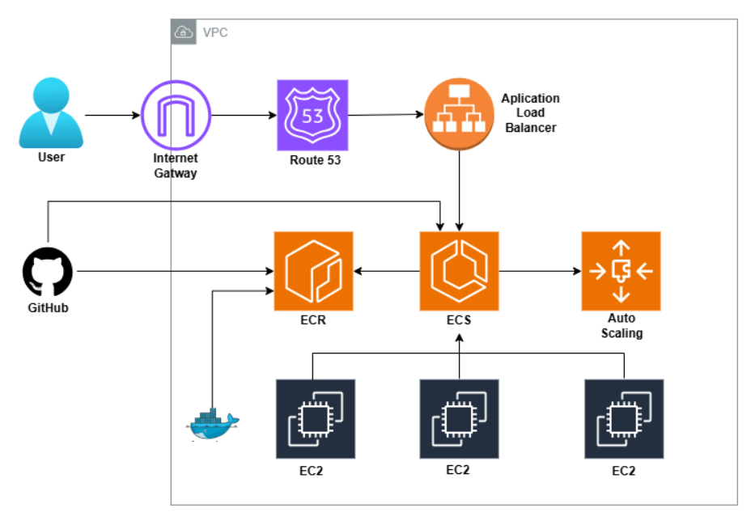

# 🚀 Projeto Prático de CI/CD com GitHub Actions e AWS ECS Fargate

Este projeto tem como objetivo construir **uma esteira de CI/CD** para o deploy automatizado de uma aplicação **backend containerizada** na **AWS**, utilizando **GitHub Actions, ECR, ECS Fargate, ALB e Route 53**.  

O projeto também inclui **teste de performance** com auto scaling dinâmico para simular carga real e validar a resiliência da aplicação.

---

## 📘 Sumário

1. [Introdução](#-introdução)
2. [Arquitetura do Projeto](#-arquitetura-do-projeto)
3. [Custos Estimados](#custos-estimados)
4. [Estrutura do Projeto](#estrutura-do-projeto)
5. [Requisitos](#requisitos)
6. [Provisione o projeto no seu ambiente local](#provisione-o-projeto-no-seu-ambiente-local)
7. [Configuração de Credenciais](#configuração-de-credenciais)
8. [Configuração Passo a Passo](#configuração-passo-a-passo)
9. [Execução do Workflow](#execução-do-workflow)
10. [Teste de Performance](#teste-de-performance-auto-scaling)
11. [Conclusão](#conclusão)


---

## 🧭 Introdução

O projeto tem como foco principal a **automação de build e deploy** de um backend em container, aplicando conceitos de **CI/CD na AWS**.  
Todo o fluxo é gerenciado pelo **GitHub Actions**, desde o build da imagem Docker até a atualização automática do serviço ECS em execução.

---

## 🏗️ Arquitetura do Projeto




**Componentes principais:**
- **Route 53** — DNS e domínio customizado.  
- **ACM** — Certificado SSL/TLS para HTTPS.  
- **Application Load Balancer (ALB)** — Distribuição de tráfego e redirecionamento HTTP → HTTPS.  
- **ECS Fargate** — Execução de containers sem necessidade de gerenciar servidores.  
- **ECR** — Repositório de imagens Docker.  
- **GitHub Actions** — Automação do pipeline CI/CD.  
- **Auto Scaling ECS** — Escalonamento automático com base na utilização de CPU.  

---

## 💰 Custos Estimados (AWS Free Tier)

| Serviço | Estimativa | Observação |
|----------|-------------|------------|
| ECS Fargate | ~$0.04/h | Grátis por 750h no Free Tier |
| ECR | ~$0.10/mês | Armazenamento da imagem |
| ALB | ~$0.025/h | Pago por hora de uso |
| Route 53 | ~$0.50/mês | Por zona hospedada |
| ACM | Grátis | Certificados SSL |

> 💡 Custos variam conforme uso e região.

---

## 📁 Estrutura do Projeto

```
projeto-cicd-pipeline/
├── .github/
│   └── workflows/
│       └── build-and-deploy.yml
├── src/
│   └── main.ts
├── Dockerfile
├── health-check.py
├── package.json
├── tsconfig.json
├── .gitignore
└── README.md
```

---

## ⚙️ Requisitos

Antes de iniciar, garanta que você possui:

- ✅ Conta ativa na **AWS**  
- ✅ Usuário **IAM** com política de administrador  
- ✅ Conta no **GitHub**  
- ✅ Um **domínio próprio ativo** (ex: `meuprojeto.com.br` pode comprar via registro.br)  
  > ⏳ Após comprar o domínio, pode levar até **24h** para propagação DNS.

---

## ⚙️ Provisione o projeto no seu ambiente local

Clone Meu repositório:

```bash
# Navegue até o diretório onde você quer salvar o clone
cd /caminho/do/seu/diretorio

# O comando 'clone' irá criar uma pasta com o nome do repositório
git clone https://github.com/brunocco/proj-cicd-papiline.git

# Entre na nova pasta (a cópia local do repositório)
cd NOME_DO_REPOSITÓRIO
```
Desvincule do Repositório Original:

```bash
# Verifique o link remoto atual (deve mostrar 'origin')
git remote -v

# Remova o link 'origin'
git remote remove origin

# Verifique novamente (não deve mostrar nenhum 'remote')
git remote -v
```
Crie um Novo Repositório Vazio (Remoto)

Acesse a interface web do seu serviço Git (ex: GitHub) e crie um novo repositório vazio.
Não adicione README, .gitignore ou licença; apenas crie o repositório.
Após a criação, o serviço exibirá a URL do novo repositório e as instruções para vinculá-lo. Copie essa URL.

Vincular ao Novo Repositório (Seu)

```bash
# Substitua <URL_DO_SEU_NOVO_REPOSITÓRIO> pela URL copiada no Passo 4
git remote add origin <URL_DO_SEU_NOVO_REPOSITÓRIO>

# Verifique para confirmar que 'origin' agora aponta para o seu novo repositório
git remote -v
```
---

## 🔐 Configuração de Credenciais

Crie um **usuário IAM** com acesso programático e adicione as políticas de administrador (apenas para esse projeto, depois exclua o usuário por segurança), crie suas credenciais e anote em um bloco de notas. Em seguida, adicione as credenciais no **GitHub Secrets** do repositório "Settings/Secrets e Variables/actions/repository secret":

| Nome | Descrição |
|------|------------|
| `AWS_ACCESS_KEY_ID` | Access Key gerada |
| `AWS_SECRET_ACCESS_KEY` | Secret Key gerada |
| `AWS_ACCOUNT_ID` | ID da conta AWS |

Adicione também as **variáveis de ambiente (Repository Variables):**

| Nome | Exemplo |
|------|----------|
| `ECR_REPOSITORY` | `proj-cicd-ecr` |
| `ECS_CLUSTER` | `proj-cicd-cluster` |
| `ECS_TASK_DEFINITION` | `proj-cicd-td` |
| `ECS_SERVICE` | `proj-cicd-sv` |
| `AWS_REGION` | `us-east-1` |

---

## ☁️ Configuração Passo a Passo

### 1️⃣ Criar Grupo de Segurança
**Nome:** `proj-cicd-sg-web`  
**Descrição:** Permite acesso web público  
**VPC:** Padrão  

**Inbound Rules:**
| Tipo | Protocolo | Porta | Origem | Descrição |
|------|------------|--------|---------|------------|
| HTTP | TCP | 80 | 0.0.0.0/0 | Acesso HTTP público |
| HTTPS | TCP | 443 | 0.0.0.0/0 | Acesso HTTPS público |
| TCP Personalizado | TCP | 3000 | 0.0.0.0/0 | Acesso à aplicação containerizada |

**Outbound Rules:** padrão (liberado)

---

### 2️⃣ Criar Repositório ECR
Crie um repositório no **ECR** e adicione o nome em `ECR_REPOSITORY`.

---

### 3️⃣ Criar Cluster ECS
**Nome:** `proj-cicd-cluster`  
**Configurações:**
- Tipo de infraestrutura: **Fargate**
- Container Insights: **Ativado**
- Restante: padrão

---

### 4️⃣ Criar Certificado ACM
Solicite um certificado **para o seu domínio** via **AWS Certificate Manager**.  
> O domínio precisa estar ativo e verificado.(recomendo que compre um dia antes de fazer o projeto , pois demora pra validar)

---

### 5️⃣ Criar Target Group
**Nome:** `proj-cicd-tg`  
- Protocolo: HTTP  
- Porta: 3000  
- VPC: padrão  
- Health check: `/health`  
- Timeout: 30s  
- Intervalo: 120s  

---

### 6️⃣ Criar Application Load Balancer
**Nome:** `proj-cicd-alb`  
- Esquema: Voltado para internet 
- VPC: padrão  
- Sub-redes: `1a` e `1b` (atenção para ser o mesmo do service) 
- Grupo de segurança: `proj-cicd-sg-web`  

**Listeners:**
- Porta **80 (HTTP)** → redirecionar para HTTPS (443)  
- Porta **443 (HTTPS)** → redirecionar para o Target Group  
- Certificado: emitido pelo **ACM** (do seu dominio)

**Ainda em Load balance, em editores e regras, clique no protocolo http:80:**
- editar listener
- redirecionar para URL:
- Protocolo https, porta 443

---

### 7️⃣ Configurar Route 53
**Crie um registro do tipo A (Alias)**:
- Clique em sua zona hospedata. 
- crie o registro: tipo A
- Nome: `www ou app ou admin ou o que vc preferir`(isso fica antes do dominio) 
- rotear trafego para: Application and Classic Load Balancer
- Alias ativar.
- Selecione seu ALB.  
- Região: `us-east-1`

> Verifique no navegador — o domínio deve exibir:  
> 503 Service Temporarily Unavailable
> Isso indica que o ALB está ativo, mas ainda sem containers conectados.
---

### 8️⃣ Criar Task Definition
**Nome:** `proj-cicd-td`  
- Infraestrutura: Apenas Fargate  
- CPU: 1 vCPU  
- Memória: 3 GB  
- Role da execução de tarefa: `ecsTaskExecutionRole`  
- Container:
  - Nome: `proj-cicd-ct`
  - Imagem: `<account-id>.dkr.ecr.us-east-1.amazonaws.com/proj-cicd-ecr:1.0.0`
  - Porta do container: `3000`
  - Protocolo: `TCP`
  - Protocolo da aplicacao: http 
  - limite de alocação de recursos: 
  - CPU: 1
---

### 9️⃣ Criar Service
**Nome:** `proj-cicd-sv`  
**Configurações:**
- Cluster: `proj-cicd-cluster`
- Task Definition: `proj-cicd-td`
- Tipo: Fargate
- Versão: 1 ou latest
- Configuracao de computacao: 
- Estrategia de provedo de capacidade 
- Fargate
- Base: 0 
- Wight: 1
- Tarefas replicadas: 1
- Periodo de carencia: 60 segundos
- Redes:
- Vpc: Padrão
- Sub-redes: `1a` e `1b`(mesmas do load balance)
- Grupo de segurança: `proj-cicd-sg-web`
- IP público: Ativado
- Usar Load Balance: Aplication Load Balance
- Load Balancer: `proj-cicd-alb`
- Listener: `HTTPS:443`(porque a porta 80 ja esta redirecionando pra 443)
- Target Group: `proj-cicd-tg`

**Auto Scaling:** 

- Usar servico de auto scaling: 
- Numero min: 1  
- Max: 3 
- Tipo de política de escalabilidade: 
- Rastreamento de destino 
- Nome da política: AVGCPUUtilization
- Metrica de servivo do ECS: 
- ECSServiceAverageCPUUtilization 
- Valor de destino: 
- 20 (20%)
- Scale out(escalar para mais): 
- 150 (Eu vou testar se a média das maquinas em (150s)2min e meio ultrapasse 20%. Se passar vai escalar mais máquinas)
- Sacale in(escalar para menos): 
- 150 (mesmo periodo para regredir a quantidade caso volte ao normal a baixo de 20%)

---

## 🧩 Execução do Workflow

O workflow é disparado **somente via tag** no Git.  

```bash
git status
git add .
git commit -m "Preparando para primeiro deploy"
git tag -a v1.0.0 -m "Primeiro deploy"
git push origin v1.0.0
```
La em seu git em Actions agora aparecera a opção de rodar o workflow , escolha run, depois a branch main e depois tag 1.0.1 e rode.
 
Ele vai rodar todo o fluxo de cicd 
- Verifique no ECR se a imagem foi upada 
- Verifique no Service e se as tasks estão rodando e com saúde. 
- Verifique no recource map no load  balance se está redirecionando corretamente.

 
---

## 🔥 Teste de Performance (Auto Scaling)

Utilize o site [BlazeMeter](https://www.blazemeter.com) para simular carga real. 
Use um email pra logar e fazer o test 
- Criar test 
- Test de performance 
- nome do teste: HealthCheck 
- Insira o endereco de seu dominio 
- Load configuration: 
- 25 usuarios 
- 10 min 
- Load distribuicao: 
- US East (Virginia) - Amazon Web Services(cuidado para nao selecionar outra cloud provider tem que ser Amazon),depois rode o test.
 
> Observe o aumento de 1 para 3 tasks quando ultrapassar 20% em 2min e meio e também o retorno para 1 quando a simulacao de stress parar.

---

## ⚙️ Caso queira rodar local

> inicia a API com hot-reload para desenvolvimento

```bash
npm run dev
```

> compila o projeto TypeScript para JavaScript (gera o dist)

```bash
npm run build
```

> roda o projeto já compilado (node dist/main.js)

```bash
npm start
```

## 🐳 Docker

🔨 Build da imagem

```bash
docker build -t minha-api .
```

▶️ Rodar o container

```bash
docker run -p 3025:3025 minha-api
```
---

## ✅ Conclusão

Com este projeto foi possível:
- Implementar **CI/CD automatizado** com GitHub Actions  
- Realizar **deploy contínuo** no ECS Fargate  
- Configurar **domínio customizado com HTTPS**  
- Validar **auto scaling sob carga real**  

💡 **Resultado final:** pipeline funcional, aplicação acessível via domínio seguro e infraestrutura totalmente gerenciada pela AWS.

---

📌 **Autor:** *Bruno Cesar*  
🗓️ *Outubro/2025*  
📧 *bruno_cco@hotmail.com*
🔗 **LinkedIn:** *[[Acesse aqui](https://www.linkedin.com/in/bruno-cesar-704265223/)]*
✍️ **Medium:** *[[Acesse aqui](https://medium.com/@brunosherlocked)]*
